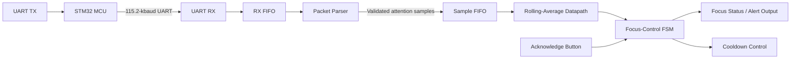

# Focus or Fry

An end-to-end FPGA telemetry-processing system built to explore digital design, asynchronous serial communication, streaming datapaths, control logic, and SystemVerilog verification.

The system transfers attention telemetry from an STM32 MCU to a Basys 3 FPGA over UART. The FPGA validates incoming packets, buffers accepted samples, computes a rolling average, and drives a configurable focus-control state machine.

> **Project status:** Complete  
> **Development period:** September 2025 – July 2026

---

## Overview

Focus or Fry began as an experiment in processing focus-related telemetry with custom FPGA hardware.

The completed design implements the following data path:



The project focuses on the FPGA and embedded communication architecture rather than EEG acquisition itself. The current demonstration uses telemetry generated by the STM32.

---

## Key Features

### Parameterized UART Core

The custom UART subsystem supports configurable:

- System clock frequency
- Baud rate
- Data width
- Oversampling ratio
- TX FIFO depth
- RX FIFO depth

The default hardware configuration uses:

| Parameter | Value |
|---|---:|
| FPGA clock | 100 MHz |
| Baud rate | 115,200 baud |
| Frame format | 8N1 |
| Oversampling | 16× |
| TX FIFO depth | 64 entries |
| RX FIFO depth | 64 entries |

The receive path includes:

- A two-flop synchronizer for the asynchronous RX input
- Falling-edge detection for start-bit alignment
- Start-edge re-phasing
- Centre-bit sampling
- RX and TX finite-state machines
- Framing-error detection
- FIFO-backed host interfaces

---

### Packet Parsing and Validation

Telemetry is transmitted using a four-byte packet:

| Byte | Field | Description |
|---:|---|---|
| 0 | Start byte | Fixed synchronization value `0xAA` |
| 1 | Sequence number | Identifies packet order |
| 2 | Attention value | Unsigned 8-bit telemetry sample |
| 3 | Checksum | XOR of the preceding packet fields |

The checksum is calculated as:

```text
checksum = 0xAA ^ sequence_number ^ attention_value
```

The packet parser:

- Discards unrelated bytes until it detects the start marker
- Extracts the sequence number and attention value
- Rejects packets with invalid checksums
- Preserves the ordering of back-to-back valid packets
- Buffers accepted attention samples in an output FIFO
- Reports an error when an accepted sample cannot be buffered

---

### Rolling-Average Datapath

Validated attention samples feed a parameterized rolling-average module.

Rather than summing the complete window for every new sample, the datapath maintains:

- A circular sample buffer
- A write pointer
- A running sum
- A widened accumulator
- A sample counter
- A one-cycle output-valid pulse

After the initial window fills, each new sample uses:

```text
new_sum = previous_sum - oldest_sample + newest_sample
```

This provides constant-time `O(1)` work per incoming sample.

For power-of-two window depths, the average is calculated using a right shift rather than a general divider.

---

### Focus-Control FSM

The rolling average feeds a configurable focus-control state machine with:

- Programmable attention threshold
- Configurable consecutive-low-sample limit
- Latched focus-loss output
- Synchronized acknowledgement input
- Configurable post-acknowledgement cooldown
- Automatic recovery after healthy samples

A single low average does not immediately trigger focus loss. The controller requires a configurable number of consecutive below-threshold averages before asserting the output.

Once triggered, the focus-loss request remains active until it is acknowledged. The controller then enters a cooldown state to prevent immediate retriggering.

The current hardware defaults are:

| Parameter | Default |
|---|---:|
| Attention threshold | 60 |
| Consecutive-low limit | 2 |
| Rolling-window depth | 4 samples |
| Cooldown | 5 seconds |

All values are parameterized in RTL.

---

## RTL Architecture

The principal FPGA modules are:

| Module | Purpose |
|---|---|
| `uart_core.v` | Integrates the UART transmitter, receiver, baud generator, synchronizer, phase counter, and FIFOs |
| `uart_rx.v` | Receives UART frames using centre-bit sampling and reports malformed stop bits |
| `uart_tx.v` | Serializes outgoing UART data |
| `baud_generator.v` | Generates the configurable oversampling tick |
| `phase_counter.v` | Aligns receive sampling with the detected start bit |
| `sync_2ff.v` | Synchronizes asynchronous external inputs |
| `FIFO.v` | Parameterized synchronous FIFO used throughout the design |
| `packet_rx.v` | Locates, validates, and buffers incoming telemetry packets |
| `rolling_avg.v` | Computes a rolling average using a circular buffer and running sum |
| `focus_detector.v` | Implements thresholding, consecutive-sample filtering, acknowledgement, and cooldown |
| `top_focus_demo.v` | Integrates the complete FPGA telemetry-processing pipeline |

---

## Verification

The design is verified using self-checking SystemVerilog testbenches. Tests terminate with `$fatal` when expected behaviour is not observed.

### UART Verification

`tb_uart_core.sv` verifies:

- TX-to-RX loopback
- Multiple ordered bytes
- FIFO-backed writes and reads
- Malformed stop-bit injection
- Framing-error detection

`tb_baud_generator.sv` verifies:

- Tick period
- One-cycle tick width
- Repeated timing consistency

Additional unit tests verify the RX, TX, FIFO, and phase-counter modules.

---

### Packet-Parser Verification

`tb_packet_rx.sv` verifies:

- Valid packet acceptance
- Correct attention-value extraction
- Garbage-byte rejection before the start marker
- Recovery and resynchronization
- Invalid-checksum rejection
- Back-to-back packet ordering
- Output-FIFO overflow handling
- Preservation of previously accepted samples after overflow

---

### Rolling-Average Verification

`tb_rolling_avg.sv` verifies:

- Initial rolling-window warm-up
- Suppression of premature valid outputs
- Known arithmetic results
- Circular-buffer eviction of the oldest sample
- Reset during a partially filled window
- Gaps and stalls in the incoming stream
- Continuous multi-sample operation
- Accumulator-width and overflow behaviour

The overflow stress test streams 64 maximum-value samples through an eight-entry rolling window and checks every resulting average.

---

### Focus-Control Verification

`tb_focus_detector.sv` verifies:

- Reset behaviour
- Healthy above-threshold averages
- Consecutive-low-sample filtering
- Triggering at the configured limit
- Latched focus-loss output
- Acknowledgement handling
- Cooldown retrigger suppression
- Correct operation after cooldown
- Resetting the low-sample counter after recovery

---

### End-to-End Verification

`tb_top_focus_demo.sv` exercises the integrated system using cycle-accurate UART traffic at:

- 100 MHz FPGA clock
- 115,200 baud
- 8N1 framing

The system test verifies:

1. Correct reset state
2. UART reception of healthy telemetry
3. Rolling-average data propagation
4. Detection of sustained low attention values
5. Focus-loss assertion
6. Acknowledgement handling
7. Return to the focused state

---

## Hardware

### FPGA

- Digilent Basys 3
- Xilinx Artix-7 FPGA
- 100 MHz board clock
- On-board buttons for reset and acknowledgement
- On-board LEDs for debug and state visibility

### Microcontroller

- STM32F401RE-based development board
- STM32 HAL firmware
- USART2 configured for 115,200 baud, 8 data bits, no parity, and one stop bit

### Connections

At minimum:

| STM32 | Basys 3 |
|---|---|
| UART TX | FPGA UART RX |
| GND | GND |

Optional bidirectional communication:

| Basys 3 | STM32 |
|---|---|
| FPGA UART TX | UART RX |

Both boards use 3.3 V logic. A shared ground is required.

---

## Debug Outputs

The integrated FPGA demonstration exposes internal state through the Basys 3 LEDs:

| LED | Signal |
|---:|---|
| 0 | Heartbeat |
| 1 | RX FIFO contains data |
| 2 | RX FIFO full |
| 3 | UART framing error |
| 4 | Rolling-average output-valid activity |
| 5 | Focused |
| 6 | Focus lost |
| 7 | Acknowledge-button state |

The one-cycle rolling-average valid pulse is stretched so that it remains visible on a physical LED.

---

## Repository Structure

```text
focus-or-fry/
├── fpga/
│   ├── sources_1/new/
│   │   ├── FIFO.v
│   │   ├── baud_generator.v
│   │   ├── focus_detector.v
│   │   ├── packet_rx.v
│   │   ├── phase_counter.v
│   │   ├── rolling_avg.v
│   │   ├── sync_2ff.v
│   │   ├── top_focus_demo.v
│   │   ├── uart_core.v
│   │   ├── uart_rx.v
│   │   └── uart_tx.v
│   ├── sim/
│   │   ├── tb_baud_generator.sv
│   │   ├── tb_focus_detector.sv
│   │   ├── tb_packet_rx.sv
│   │   ├── tb_rolling_avg.sv
│   │   ├── tb_top_focus_demo.sv
│   │   ├── tb_uart_core.sv
│   │   └── ...
│   └── constrs_1/
│       └── imports/digilent-xdc-master/
│           └── Basys-3-Master.xdc
│
├── stm32/
│   ├── uart_spammer/
│   └── uart_echo_led/
│
└── README.md
```

---

## Running the Simulations

### Requirements

- Xilinx Vivado
- A SystemVerilog-compatible simulator

### Vivado

1. Open or create the FPGA project in Vivado.
2. Add the Verilog files under `fpga/sources_1/new/` as design sources.
3. Add the desired `tb_*.sv` file under `fpga/sim/` as a simulation source.
4. Set the selected testbench as the simulation top.
5. Run behavioural simulation.
6. Confirm that all self-checking tests complete without `$fatal`.

Each major subsystem has a separate testbench so that failures can be isolated before running the integrated system test.

---

## Running on Hardware

### FPGA

1. Add all RTL sources to a Vivado project targeting the Basys 3.
2. Set `top_focus_demo` as the top-level module.
3. Add the Basys 3 XDC constraints file.
4. Assign the clock, UART, button, and LED ports.
5. Run synthesis and implementation.
6. Generate and program the bitstream.

### STM32

1. Open `stm32/uart_spammer/` in STM32CubeIDE.
2. Build the project.
3. Flash the STM32 board.
4. Connect the STM32 UART TX pin to the assigned Basys 3 UART RX pin.
5. Connect the board grounds.
6. Observe the FPGA status and focus-state LEDs.

---

## Design Highlights

This project demonstrates:

- Parameterized synthesizable RTL
- Finite-state-machine design
- Asynchronous-input synchronization
- UART timing and centre-bit sampling
- FIFO-based flow control
- Packet framing and validation
- Circular-buffer arithmetic
- Constant-time streaming computation
- Configurable threshold and cooldown control
- Module-level verification
- End-to-end SystemVerilog verification
- FPGA and STM32 hardware integration

---

## Scope and Safety

This repository is an educational FPGA and embedded-systems project.

The completed implementation processes telemetry and exposes its result through digital status outputs. It does **not** implement TENS, high-voltage stimulation, or any medical treatment functionality.

The system is not a medical device and should not be used for diagnosis or treatment.

---

## Project Status

The intended RTL and verification goals are complete:

- [x] Parameterized UART transmitter and receiver
- [x] TX and RX FIFO buffering
- [x] Asynchronous-input synchronization
- [x] Framing-error detection
- [x] Packet synchronization and validation
- [x] Sequence and attention-value extraction
- [x] Invalid-packet rejection
- [x] Rolling-average datapath
- [x] Configurable focus-control FSM
- [x] Acknowledgement and cooldown handling
- [x] STM32-to-FPGA UART communication
- [x] Module-level self-checking testbenches
- [x] End-to-end system verification
- [x] Basys 3 demonstration

Further development is not currently planned. The project is retained as a completed exploration of FPGA RTL design, serial communication, streaming computation, and verification.
